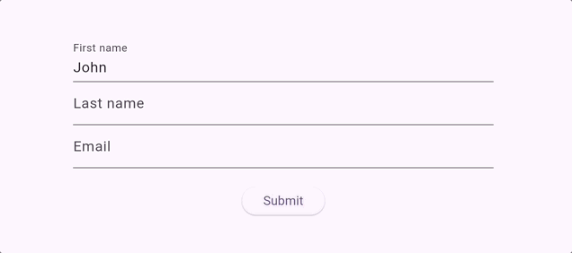

# Formality

A simple form validation library for Flutter.

## Example

```dart
class UserFormModel {
  final String firstName;
  final String lastName;

  UserFormModel({
    required this.firstName,
    required this.lastName,
  });
}

class MyPage extends StatelessWidget {
  @override
  build(context) {
    return FormBuilder(
      initialFormData: UserFormModel(
        firstName: 'John',
        lastName: 'Smith',
      ),
      builder: (context, formData, controller) {
        final UserFormModel(:firstName, :lastName) = formData;

        return Column(
          children: [
            Validation(
              valid: firstName.isNotEmpty,
              child: TextFormField(
                initialValue: firstName,
                decoration: const InputDecoration(labelText: 'First name'),
                onChanged: (value) => controller.setForm(
                  formData.copyWith(firstName: value),
                ),
              ),
            ),
            Validation(
              valid: lastName.isNotEmpty,
              child: TextFormField(
                initialValue: lastName,
                decoration: const InputDecoration(labelText: 'Last name'),
                onChanged: (value) => controller.setForm(
                  formData.copyWith(lastName: value),
                },
              ),
            ),
            ElevatedButton(
              child: Text('Submit'),
              onPress: () {
                if (controller.validate()) {
                  // Submit form
                }
              }
            )
          ],
        );
      }
    );
  }
}
```

All validation widgets animate errors as shown below:

.

Field animations can be customized using the `Validation.childAnimationBuilder` and `Validation.errorAnimationBuilder` builders.

## Required fields

Fields can be labeled as optional using the `Validation.required` field.

```dart
class UserFormModel {
  final String name;
  final String description;

  UserFormModel({
    required this.name,
    required this.description,
  });
}

class MyPage extends StatelessWidget {
  @override
  build(context) {
    return FormBuilder(
      initialFormData: UserFormModel(
        name: 'John Smith',
        description: '',
      ),
      builder: (context, formData, controller) {
        final UserFormModel(:name, :description) = formData;

        return Column(
          children: [
            Validation(
              valid: name.isNotEmpty,
              required: false,
              child: TextFormField(
                initialValue: name,
                decoration: const InputDecoration(labelText: 'Name'),
                onChanged: (value) => controller.setForm(
                  formData.copyWith(name: value),
                ),
              ),
            ),
            Validation(
              valid: lastName.isNotEmpty,
              // Mark a field as optional to allow submission with failing validation.
              required: false,
              child: TextFormField(
                initialValue: lastName,
                decoration: const InputDecoration(labelText: 'Optional description'),
                onChanged: (value) => controller.setForm(
                  formData.copyWith(description: value),
                },
              ),
            ),
            ElevatedButton(
              child: Text('Submit'),
              onPress: () {
                if (controller.validate()) {
                }
              }
            )
          ],
        );
      }
    );
  }
}
```